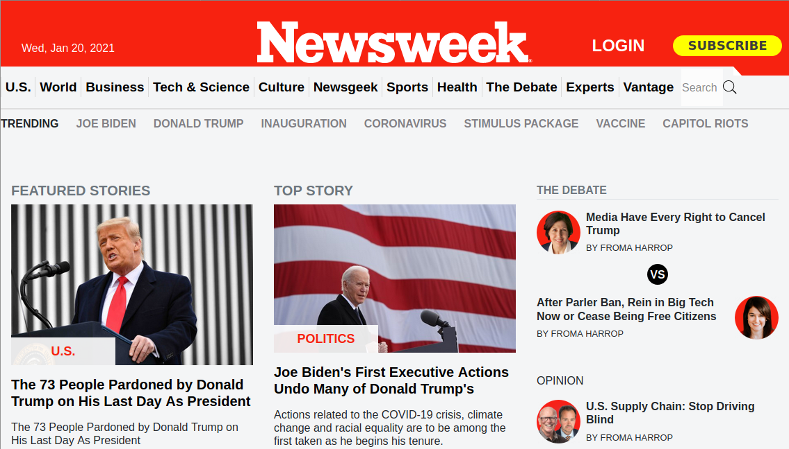

# HTML 2.0 - Project 3: Project 3: Using Bootstrap

The goal of this project is to clone the following page from the Newsweek website: https://web.archive.org/web/20210120125445/https://www.newsweek.com/ .
To achieve this, the project makes use of HTML5, Bootstrap and CSS3. This project focuses on using Bootstrap to style the page elements

## Built With

- HTML5 , CSS3 , Bootstrap
- Windows, Linux

## Live Demo

[Live Demo Link]( https://vitorelourenco.github.io/NewsweekClone/ )

## Getting Started

**To get a local copy up and running follow these simple steps.**

### Prerequisites

-Windows, Mac or Linux machine 
-Web browser other than Internet Explorer

### Setup

-Download all the files to the same folder and run index.html

### Install

-No instalation required

### Deployment

-You can deploy this project forking it on GitHub and then going to:
->Repository
->Settings
->GitHub Pages
(Select source)
->Save

The project will be deployed to https://<yourgithubusername>.github.io/<repositorysname>/

## Authors

👤 **Author1**

- GitHub: [@vitorelourenco](https://github.com/vitorelourenco/)
- Twitter: [@Vitorel](https://twitter.com/Vitorel)
- LinkedIn: [vitoremanuellourenco](https://www.linkedin.com/in/vitoremanuellourenco/)

👤 **Author2**

- GitHub: [Amal Hersi](https://github.com/Amalcxc)
- Twitter: [@Amalcx4](https://twitter.com/home?lang=en)
- LinkedIn: [Amal Hersi](https://www.linkedin.com/in/amal-hersi-a29583205/)

## 🤝 Contributing

Contributions, issues, and feature requests are welcome!

Feel free to check the [issues page]( https://github.com/vitorelourenco/NewsweekClone/issues ).

## Show your support

Give a ⭐️ if you like this project!

## Acknowledgments

- Microverse ( https://www.microverse.org/ )
- Newsweek ( https://www.newsweek.com/ )
- Bootstrap ( https://getbootstrap.com/ )

## 📝 License

This project is [MIT](lic.url) licensed.

